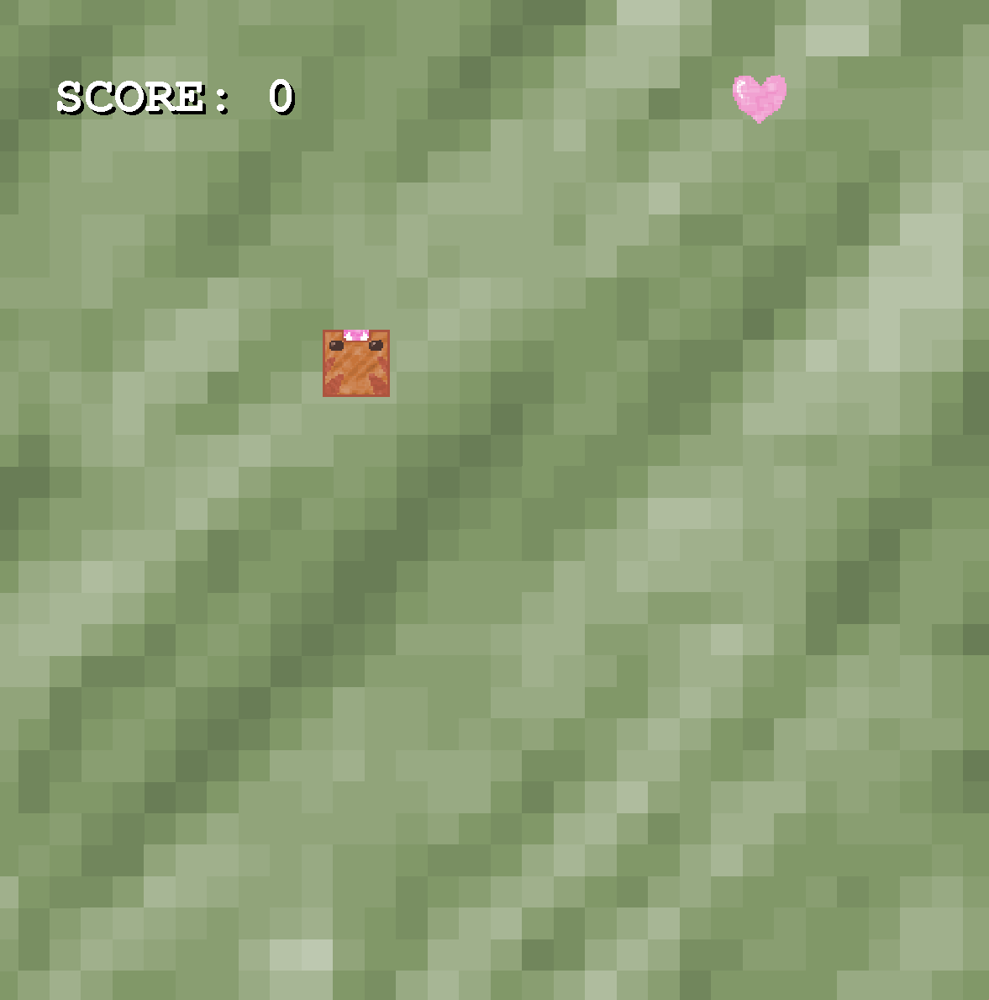
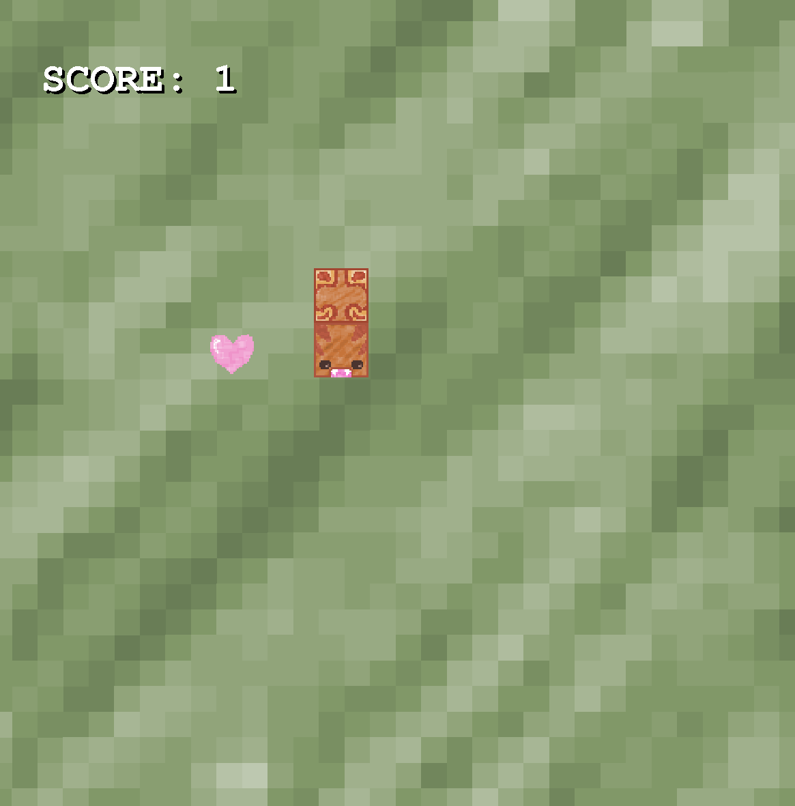
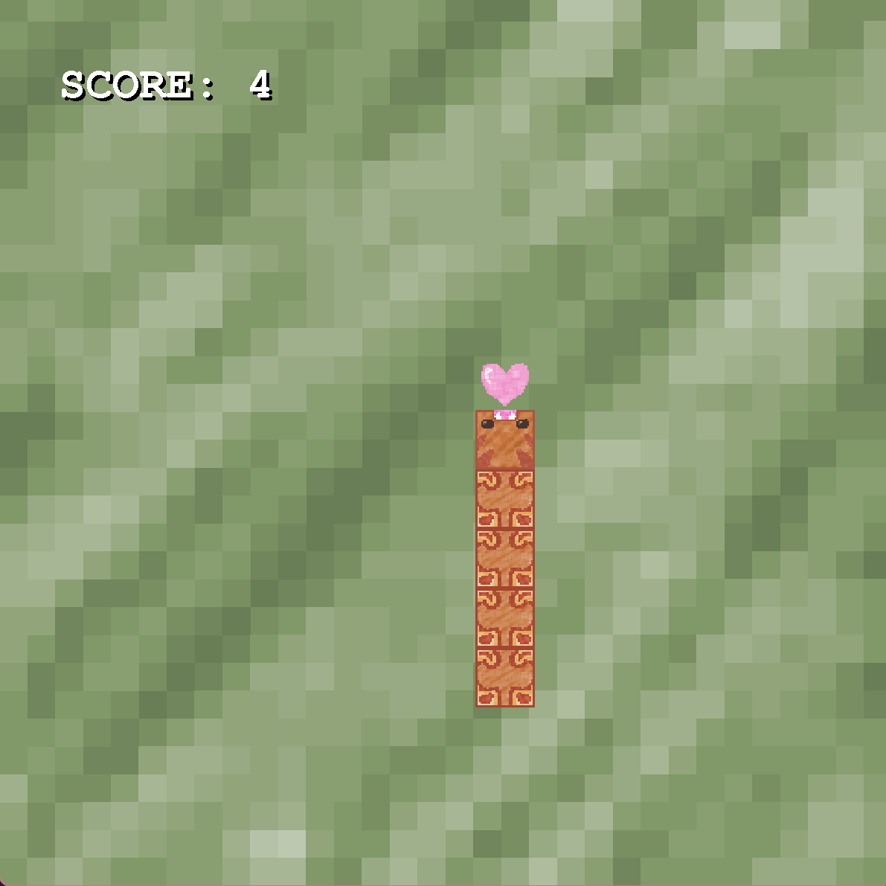
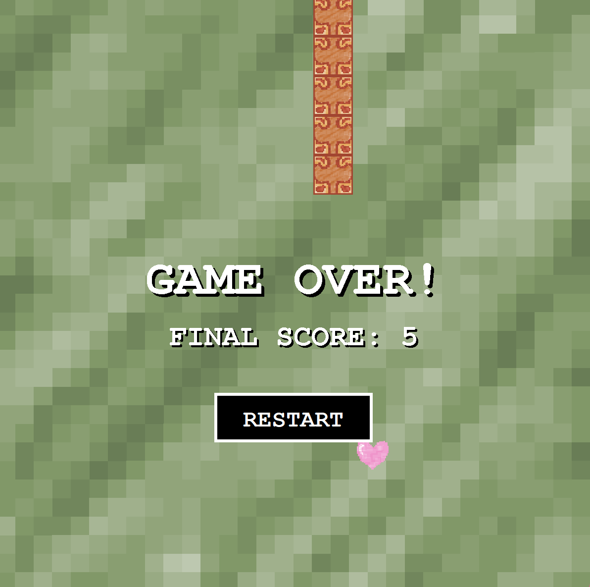
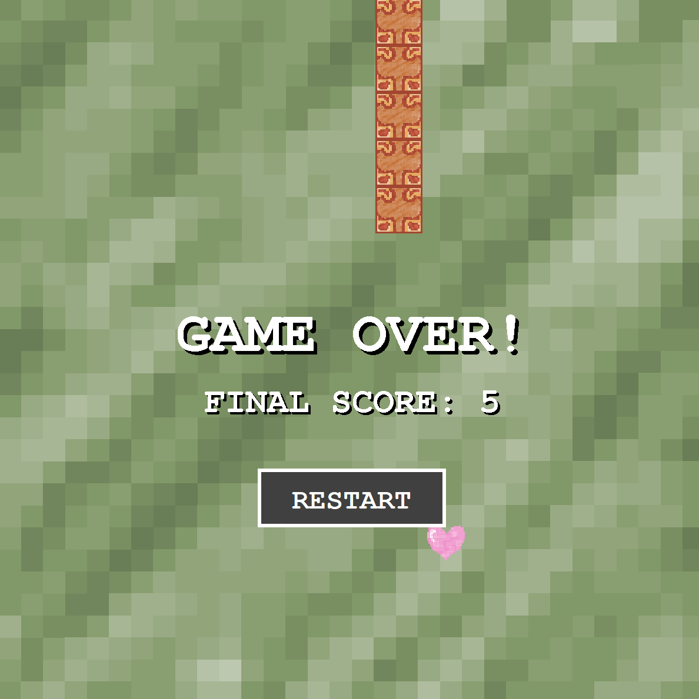
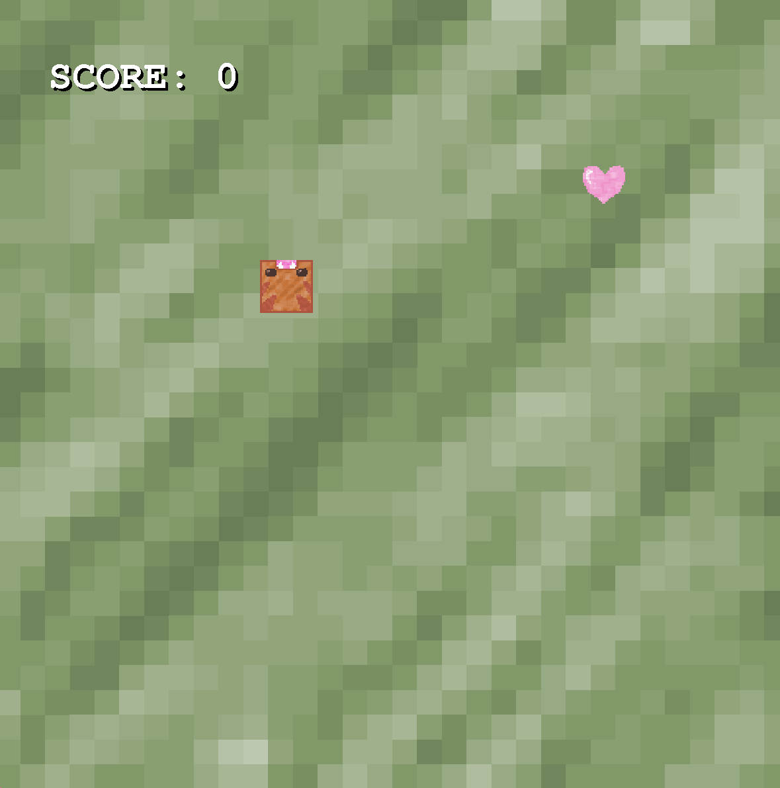

# Snake
A simple Snake game built in Java with Swing.  
Features custom graphics, arrow key controls, and a restart option after Game Over.

## Description
The goal is to eat food, grow, and avoid colliding with the snake’s body or the walls.  

### Features
- Simple and classic gameplay
- Custom sprites for snake head, body, background, and food  
- Game Over screen with final score and restart button  
- Arrow key controls
### How to Run
Clone the repository:
git clone https://github.com/mariasjoholm/Snake.git

Once you have everything ready and run the code, you need to press up, down, left or right on your keyboard to start the game.

## Screenshots

**Start screen:**  
Press any of the arrow keys (right, left, up, or down) on the keyboard to start the game:  

**Gameplay**  
After pressing an arrow key, move right, left, up, or down to control the snake and eat the hearts/food. 

**Scoring**  
You earn points and the snake’s body grows each time you eat a heart/food:  

**Game Over**  
If the snake runs into itself or the walls, the game ends. Your score is based on how many hearts/food you’ve eaten (1 point= 1 heart/food): 

**Restart**  
To restart, click the **Restart** button. It lights up when you hover over it:  

**New game**  
After restarting, press one of the arrow keys again to begin a new game:  

